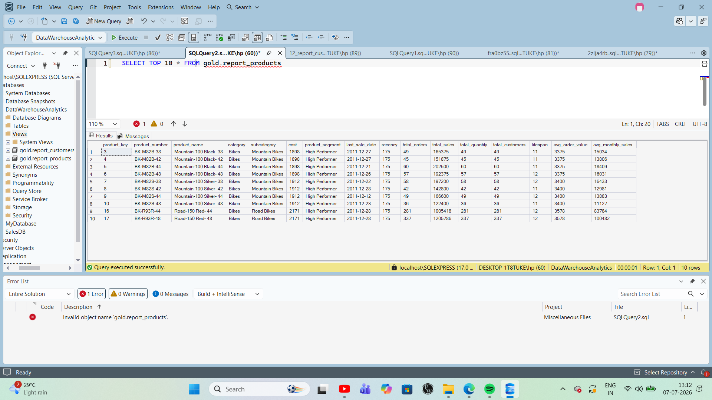

# SQL Advanced Data Analytics Project

## 📌 Project Overview

This project demonstrates advanced SQL techniques to analyze sales data and generate actionable business insights. It includes trend analysis, cumulative calculations, performance evaluation, customer segmentation, proportional analysis, and business reporting.

## 🎯 Problem Statement

Organizations generate large amounts of sales data but often lack meaningful insights for decision-making. This project applies advanced SQL queries to uncover trends, measure performance, segment customers, and build business reports.

## 🛠️ Tools & Technologies

- Microsoft SQL Server
- SQL Server Management Studio (SSMS)
- SQL

## 📂 Project Structure

- datasets/
- docs/
- scripts/
- README.md

## 📈 Advanced Analytics Performed

- Change Over Time Analysis
- Cumulative Analysis
- Performance Analysis
- Part-to-Whole Analysis
- Customer Segmentation
- Customer Report
- Product Report

## 💡 SQL Concepts Used

- Common Table Expressions (CTEs)
- Window Functions
- CASE Statements
- Aggregate Functions
- Ranking Functions
- Date Functions
- Subqueries

## 📊 Sample Output
## 📊 Product Performance Report

This report analyzes product performance by summarizing key metrics such as total sales, total orders, quantity sold, customer reach, average order value, and product recency. It helps identify top-performing products and supports data-driven business decisions.

